# Data Struct and Algorithm 

#### 要坚信不论多远的远方都会到达。

# 目录

我将这个项目整体分成三大部分，第一部分是数据结构，包含，链表，队列，堆栈，树，图 5大数据结构，一个好的算法，必须要有适合的数据结构对数据进行组织，在这部分大家着重了解每种数据结构的形态，如何创建，如何实现遍历，删除，以及算法复杂度和优缺点。第二部分是具体的算法实现，重点包括两大部分十大排序，七大搜索算法。第三部分是六大算法策略，这一块主要是一些算法策略的指南，以及算法思想。

所以简单说就是：

* 五大数据结构
* 十大排序
* 七大搜索
* 六大算法策略

梳理清楚会对大家学习有所帮助。

### 零. 算法复杂度

#### 时间复杂度计算 - 大O阶方法

##### 常数阶    O(1)
##### 线性阶    O(n)
##### 对数阶    O(logn)
##### nlogn阶  O(nlogn)
##### 平方阶    O(n**2)
##### 立方阶    O(n**3)
##### 指数阶    O(2**n)

算法复杂度顺序：
```
常数阶O(1) < 对数阶O(logn) < 线性阶O(n) < nlogn阶O(nlogn) < 平方阶O(n**2) < 立方阶O(n**3) < 指数阶O(2**n) < O(n!) < O(n**n)
```
在算法的设计上 时间和空间往往是一对可以权衡的关键因素，根据实际情况可以考虑使用空间换时间，或者使用时间换空间的策略。

时间复杂度计量的并不是具体的算法时间，而是算法的执行时间随着问题规模的增长的增长趋势。

### 一. 数据结构

#### 1 线性结构

线性结构元素之间仅有线性关系，每个元素只有一个直接前驱和一个直接后继。

线性表结构大致的组成大致可以分成两类，数组和链表：
数组的特点就是需要在编译的时候事先分配好连续的内存空间用于存放数据，它方便元素的随机访问，但是不利于插入删除元素。插入删除可能需要挪动大量元素，链表则相反，它的逻辑位置相邻的元素在内存物理地址上不一定相邻。链表适合于插入，删除使用比较多的场景，对于访问元素比较耗时。

#### 1.1 数组

总结：
* 优点：查找方便
* 缺点：耗费内存，不利于插入删除 

时间复杂度:

查找时间复杂度O(1) 插入删除操作时间复杂度为O(n)

#### 1.2 链表

链表中的节点在物理内存中是不连续的，它的特点是插入和删除相当方便，需要新增节点的时候向系统申请空间，数据被删除后将内存空间还给系统。插入删除不需要移动大量数据，并且不能随机访问元素。

总结：
* 特点: 节点在内存中的分布不连续
* 优点：节省内存，方便增删元素
* 缺点：查找元素不方便

时间复杂度:

查找时间复杂度O(n) 插入删除操作时间复杂度为O(1)

类别：
* 单链表： 存在head 和 空节点作为尾节点的链表，它的遍历只是单向的，不能回头，并且head节点十分关键，一旦丢失就失去了整个链表
* 循环链表：头尾相接的单链表
* 双向链表：每个节点可以双向访问的链表

#### 1.2.1 跳表

通过增加索引来加速链表的访问速度,一般增加log2 n个。查询的时间复杂度为O(log2 n),如果有1024个结点的话，访问最后一个结点，普通的链表需要1024次，跳表只要10次，跳表其实采用的是空间换时间的策略，虽然时间大大降低了，但是增加的结点，占用了额外的空间，并且插入删除需要不断更新索引。加大了维护的成本。

它的空间复杂度为O(n)

[漫画：什么是跳表？](https://zhuanlan.zhihu.com/p/53975333)

#### 1.3 栈

栈是后进先出的一种线性数据结构，堆栈由于没有在随机位置插入删除的需求，所以使用数组和链表表示都是可以的，但是需要事先估计元素的规模。在实际使用中如果元素变化不可估计，建议使用链表表示的堆栈，如果元素的个数的范围大致可以估计则可以使用数组表示。

##### 栈的应用场景:

* 递归 

方法自身调用自身，递归函数需要设置递归的终止条件，否则会进入无限的循环当中，在递归过程中，对于每一层递归，方法的局部变量，参数，返回值都被压入栈中。在退回阶段，位于栈顶的局部变量，参数，返回值都被弹出，用于程序的执行。

* 四则运算表达式求值
将运算表达式通过逆波兰表示后结合堆栈进行计算

#### 1.4 队列

队列是先进先出的一种线性数据结构，队列由于没有在随机位置插入删除的需求，所以使用数组和链表表示都是可以的。

#### 1.5 哈希表

#### 2. 树

有层次关系，只有一个根节点，上层元素对应多个下层节点，下层结点对应一个上层节点，子树个数没有限制，但互不相交

##### 基本概念

* ****结点的度：**** 结点拥有的子树个数
* ****树的度：**** 树内各结点度的最大值


* ****结点的层次：**** 从根开始，根为第一层，一直顺着往下递增。
* ****树的高度：**** 树中结点的最大层次


* ****根结点：**** 无双亲，且唯一
* ****分支结点：**** 度不为0的称为分支结点
* ****叶子结点：**** 度为0的结点称为叶子结点，无孩子，可以多个
* ****双亲结点：**** 也称为父结点
* ****孩子结点：**** 也称为子结点
* ****子孙结点：**** 以某个结点为根的子树中的任意结点都称为该结点的子孙结点
* ****兄弟结点：**** 同一个双亲结点的子结点互为兄弟结点
* ****堂兄弟结点：**** 双亲在同一层的结点互为堂兄弟


* ****有序树：**** 树中结点的各子树看成从左到右有序的，不能互换的树
* ****无序树：**** 非有序树
* ****森林：**** 若干棵互不相交树的集合

##### 二叉树

由一个根结点和两颗互不相交的，分别称为根结点左子树和右子树的二叉树组成。（注意每个结点最多只能有两个子树）

###### 二叉树特点

* 每个结点最多有两个子树，可以没有子树，也可以只有一棵子树
* 左子树和右子树的顺序不可颠倒，即使只有一个子树也要区分它是左子树还是右子树

总结：每个节点最多有两个子树，每个节点都必须明确是左节点还是右节点

###### 二叉树种类

* ****满二叉树：**** 
在一颗二叉树中，[如果所有分支结点都存在左子树和右子树]，[并且所有叶子都在同一层上]，这种二叉树称为满二叉树

* ****满二叉树特点：****
* 叶子只能出现在最下一层
* 非叶子结点的度一定为2

* ****完全二叉树：**** 
对一颗具有n个结点的二叉树按层序编号，编号为i的结点与同样深度的满二叉树中编号为i的结点在二叉树中的位置完全相同，这种树称为完全二叉树。
满二叉树一定是完全二叉树，完全二叉树不一定是满二叉树。


****大小堆****：

大小堆属于一种完全二叉树，它的特点是任一结点的值是其子树所有结点的最大值或最小值。
* 当结点是其子树的最大值时，称为"最大堆"，也称大顶堆
* 当结点是其子树的最小值时，称为"最小堆"，也称小顶堆


* ****平衡二叉树(AVL)：****

为什么需要引入平衡二叉树，是因为按照普通二叉树的构建方式，有可能会导致极端左倾斜，或者极端右倾斜的二叉树。这种二叉树的性能很低。
平衡二叉树的特点是：要么它是一颗空树，要么它的左子树和右子树都是平衡二叉树，每个结点的左子树和右子树的高度差不多于1.我们将二叉树上结点的左子树深度减去右子树的深度的值称为平衡因子。所以平衡二叉树上所有结点的平衡因子只能是-1，0，1.

距离插入结点最近的，并且平衡因子绝对值大于1的结点为根的子树，称为最小不平衡树。

构建平衡二叉树：在插入结点的时候不断查看，当最小不平衡子树根结点的平衡因子大于1的时候就右旋转，小于-1的时候就左旋转，如果插入结点后，最小不平衡子树的平衡因子与它右子树平衡因子符号相反的时候需要对结点先进行一次旋转，在符号相同后，再反向旋转一次才能完成平衡二叉树。


* ****红黑树：****

前面提到的平衡树很好得解决了在极端不平衡都情况下二叉树退化为类似链表的树结构，但是却不是最佳的解决方案，因为平衡树要求每个节点的左子树和右子树的高度差最多等于1，太严格了，每次进行插入删除节点的时候，几乎都会破坏树的平衡，导致我们需要经常需要通过左旋和右旋来进行调整。从而降低了效率。为了解决这个问题就出现了红黑树：

红黑树具有如下特点：

1. 具有二叉查找树的特点
2. 节点只有两种，红色和黑色。
3. 根节点是黑色的，每个叶子节点都是黑色的空节点，叶子节点不存储数据。
4. 每个红色节点的两个子节点都应该是黑色的
5. 任何相邻的节点都不能同时为红色，也就是说，红色节点需要被黑色节点隔开
6. 每个节点，从该节点到达其可达的叶子节点都应该包含相同数量的黑色节点。

红黑树从根结点到叶子的最长路径不会超过最短路径的2倍。


红黑树的调整包括两类：变色和旋转，这个会在第二轮的时候给予详细说明。

****B树****与平衡二叉树的区别：

- 若根结点不是终端结点，则至少有2棵子树
- 平衡二叉树节点最多有两个子结点，而B树每个节点可以有多个子结点，m阶B树表示该树每个节点最多有m个子结点
- 平衡二叉树每个节点只有一个数据和两个指向子结点的指针，而B树每个中间节点有k-1个数据和k个子结点（k介于阶数m和m/2之间，m/2 向上取整）
- B树的所有叶子节点都在同一层，并且叶子节点只有关键字，指向孩子的指针为 null

平衡二叉树相同的点在于：B树的节点数据大小也是按照左小右大，子树与节点的大小比较决定了子树指针所处位置。

****B树中如何查找数据:****

- 从根节点开始，如果查找的数据比根节点小，就去左子树找，否则去右子树
- 和子树的多个关键字进行比较，找到它所处的范围，然后去范围对应的子树中继续查找
- 以此循环，直到找到或者到叶子节点还没找到为止


****B+树**** 它比 B 树的查询性能更高。

* ****B+树的特点：****

- 关键字数和子树相同
- 非叶子节点仅用作索引，它的关键字和子节点有重复元素
- 叶子节点用指针连在一起

****B树与B+树的区别：****

- B树节点的关键字用于在查询时确定查询区间，因此关键字数比子树数少一；而在 B+ 树中，节点的关键字代表子树的最大值，因此关键字数等于子树数。
- B+树除叶子节点外的所有节点的关键字，都在它的下一级子树中同样存在，最后所有数据都存储在叶子节点中
- 叶子节点包含了全部的数据，并且按顺序排列，B+ 树使用一个链表将它们排列起来，这样在查询时效率更快。
- 由于B+树的中间节点不含有实际数据，只有子树的最大数据和子树指针，因此磁盘页中可以容纳更多节点元素，也就是说同样数据情况下，B+ 树会 B 树更加“矮胖”，因此查询效率更快
- 有时候需要查询某个范围内的数据，由于 B+ 树的叶子节点是一个有序链表，只需在叶子节点上遍历即可，不用像 B 树那样挨个中序遍历比较大小。

****B+树的优点：****
- 层级更低，IO 次数更少
- 每次都需要查询到叶子节点，查询性能稳定
- 叶子节点形成有序链表，范围查询方便  


* [重温数据结构：理解 B 树、B+ 树特点及使用场景](https://juejin.im/entry/5b0cb64e518825157476b4a9)
* [B Trees and B+ Trees, How they are usefull in Databases](https://youtu.be/aZjYr87r1b8)


###### 二叉树存储

一般使用链式存储，见代码

###### 二叉树遍历

二叉树的遍历要求从根结点出发，按照某种次序依次访问二叉树中的所有结点，使得每个结点有且仅被访问一次。这里关键点有几个：从根结点出发，按照某个次序，每个结点都必须被访问，并且只能访问一次。

* ****遍历方式****：

* 前序遍历: 中 -> 左 -> 右
* 中序遍历: 左 -> 中 -> 右
* 后序遍历: 左 -> 右 -> 中
* 层次遍历: 从上到下层层访问

为什么要遍历？一般计算机只会处理线性序列，上述的遍历方式是将树状结构变成某种意义上的线性序列，方便计算机处理。

* ****线索化****：

线索二叉树结构：

* 结点数据
* 左孩子
* 右孩子
* 左标签
* 右标签

将二叉树转化为线索二叉树后，对它的遍历就转化为操作一个双向链表。

##### 树，森林，二叉树的转换

* 树 --> 二叉树

1. 在所有兄弟结点之间加一条线
2. 对树的每个结点，只保留它和第一个孩子结点的连线，删除它与其他孩子之间的连线
3. 对上述结果进行微调

* 森林 --> 二叉树

1. 按照上面步骤把每个树转化为二叉树
2. 第一棵二叉树不动，从第二颗二叉树开始，依次把后一颗二叉树对根结点，作为前一颗二叉树的根结点的右孩子。

* 二叉树 --> 树

1. 如果某个结点有左结点，那么它左结点的所有右孩子都和它连接起来
2. 删除原二叉树中所有结点与其右孩子结点的连线

* 二叉树 --> 森林

1. 从根结点开始，如果右孩子存在就把与右孩子的连线删除，直到所有右孩子连线都删除为止，再将每个分离后的二叉树转化为树即可。

##### 哈夫曼树 && 哈夫曼编码

#### 3. 图

在图形结构中，结点之间的关系可以是任意的，图中任意两个数据结点之间都可能相关。

##### 3.1 图的基本概念：

* 顶点:
* 无向边: 如果两个顶点之间没有方向，那么这条边就叫无向边，记作 (v1,v2)
* 无向图: 任意两个顶点之间都没有方向的图称为无向图。
* 有向边: 如果两个顶点之间有方向，那么这条边就叫有向边，记作 <v1,v2>
* 有向图: 任意两个顶点之间都是有方向的图称为有向图。
* 无向完全图：任意两个顶点之间都存在边的图。n个顶点就有(n * (n-1)) * 0.5 条边
* 有向完全图：在有向图中，如果任意两个顶点之间都存在方向互为相反的两条边，则这个图为有向完全图。n个顶点就有(n * (n-1)) 条边
* 权: 与图的边相关的数值叫做权重
* 顶点的度：无向图顶点的边数，叫做顶点的度。有向图的度又分为出度和入度。
* 连通图：在无向图中，如果从顶点v到顶点v1有路径，则v和v1是连通的，如果对于图中任意两个顶点，都是连通的，则称这个图是连通图。
* 连通分量：无向图中的极大连通图。连通分量必须是原图的子图，并且子图要是连通的，并且包含极大顶点数。
* 强连通图：对于每对顶点，v -> v1 和 v1 -> v 之间都存在路径，就称为图为强连通图。
* 连通图的生成树：它包含图中全部的n个顶点，但只有足以构成一颗树但n-1条边。
* 有向树：有向图中有一个顶点的入度为0，其余顶点的入度为1的树叫做有向树。

##### 3.2 图的表示:

* 邻接矩阵 -- 表示无向图，有向图，网
* 邻接表   -- 表示无向图，有向图，网
* [十字链表](https://blog.csdn.net/u013009575/article/details/18978431?depth_1-utm_source=distribute.pc_relevant.none-task&utm_source=distribute.pc_relevant.none-task)  -- 有向图  入度问题
* [邻接多重表](https://blog.csdn.net/weixin_42034217/article/details/84588562?depth_1-utm_source=distribute.pc_relevant.none-task&utm_source=distribute.pc_relevant.none-task) -- 无向图 关注边的时候
* 边集数组 

##### 3.3 图的遍历：

* ****[无向图深度优先遍历](https://xiaozhuanlan.com/topic/8623547109)****
* ****[无向图广度优先遍历](https://xiaozhuanlan.com/topic/8623547109)****
* ****[有向图深度优先遍历](https://xiaozhuanlan.com/topic/8623547109)****
* ****[有向图广度优先遍历](https://xiaozhuanlan.com/topic/8623547109)****

* [图的遍历(搜索)](https://blog.ihypo.net/15013034834126.html)

##### 3.4 图的最小生成树：

* 定义：

- 是一颗树: 无回路，v个顶点一定有v-1条边，向生成树里面任意加一条边都会构成回路
- 是生成树: 包含全部顶点，这v-1条边都在图里面，
- 最小：所有边的权重和最小

最小生成树核心是基于贪心算法思想，每一步都要最好，眼前最好，不一定全局最好。

约束：
- 只能从图里面选择边
- 只能正好用掉v-1条
- 不能有回路

* ****Prim算法****
* ****Kruskal算法****
* [视频教程](https://www.youtube.com/watch?v=-E42M_yDWzI)

##### 3.4 图的最短路径：

最小生成树和最短路径的区别：

* ****最小生成树****能够保证整个拓扑图的所有路径之和最小，但不能保证任意两点之间是最短路径。
* ****最短路径****是从一点出发，到达目的地的路径最小。
* 遇到求所有路径之和最小的问题用最小生成树&并查集解决。
* 遇到求两点间最短路径问题的用最短路，即从一个城市到另一个城市最短的路径问题。
* 最小生成树构成后所有的点都被连通，而最短路只要到达目的地走的是最短的路径即可，与所有的点连不连通没有关系。

* [视频教程](https://www.youtube.com/watch?v=ypE6a1Kk-6Q)
* [最小生成树算法动画演示](https://www.bilibili.com/video/av47042691/)

* ****Dijkstra****
* ****Floyd****
* ****Bellman-Ford****

* [图论最短距离(Shortest Path)算法动画演示-Dijkstra(迪杰斯特拉)和Floyd(弗洛伊德)](https://www.bilibili.com/video/av54668527)
* [几个最短路径算法Floyd、Dijkstra、Bellman-Ford、SPFA的比较](https://blog.csdn.net/v_JULY_v/article/details/6181485)
* [洛伊德算法完备算法详解](https://www.bilibili.com/video/av74605839?from=search&seid=13216477747890716269)
* [弗洛伊德算法介绍](https://lrh1993.gitbooks.io/android_interview_guide/content/data-structure/graph/Floyd.html)

### 二. 算法

#### 1. 排序算法

##### 排序中的基本概念：

* 排序的稳定性：如果两个[关键字相等]的元素，在排序前的序列中r1的记录排在r2的后面，如果排序后r1 仍然排在r2后面则说明该排序算法是稳定的。
  堆排序，快速排序，希尔排序，直接选择排序 这些是不稳定排序算法
  基数排序，冒泡排序，直接插入排序，折半插入排序，归并排序 这些是不稳定排序算法
* 内排序和外排序：内排序指的是在排序过程中，待排序的所有记录全部放置在内存中，外排序是指由于排序记录个数太多，不能同时放置在内存，整个排序过程需要在内存和磁盘之间进行多次交换数据才能完成。
* 原地排序和非原地排序：原地排序就是指在排序过程中不申请多余的存储空间，只利用原来存储待排数据的存储空间进行比较和交换的数据排序。非原地排序，需要利用额外的数组来辅助排序。
* 衡量算法的标准：
  时间性能 - 内排序主要看比较和移动这两项，外排序还要看读写磁盘IO的频繁程度
  辅助空间 - 辅助空间是指除了存放待排序所占用的存储空间外，执行算法所需要的其他存储空间。
  算法复杂性 

##### 十大排序算法

* ****冒泡法排序****

  算法原理：
  在整个冒泡过程中有两层循环，外循环用于控制轮数，内循环用于控制本轮的遍历，每次遍历都会将当前项与相邻项进行比较，如果前面一个比后面一个大，则交换他们的位置。我们对每一对相邻元素作同样的工作，从开始第一对到结尾的最后一对，这样一趟比较交换下来之后，排在最右的元素就会是最大的数。每轮都会确定一项元素在排序表中的位置。下一轮需要再针对剩余的元素做同样的工作，如此重复下去，最后完成整个数据的排列。

  
  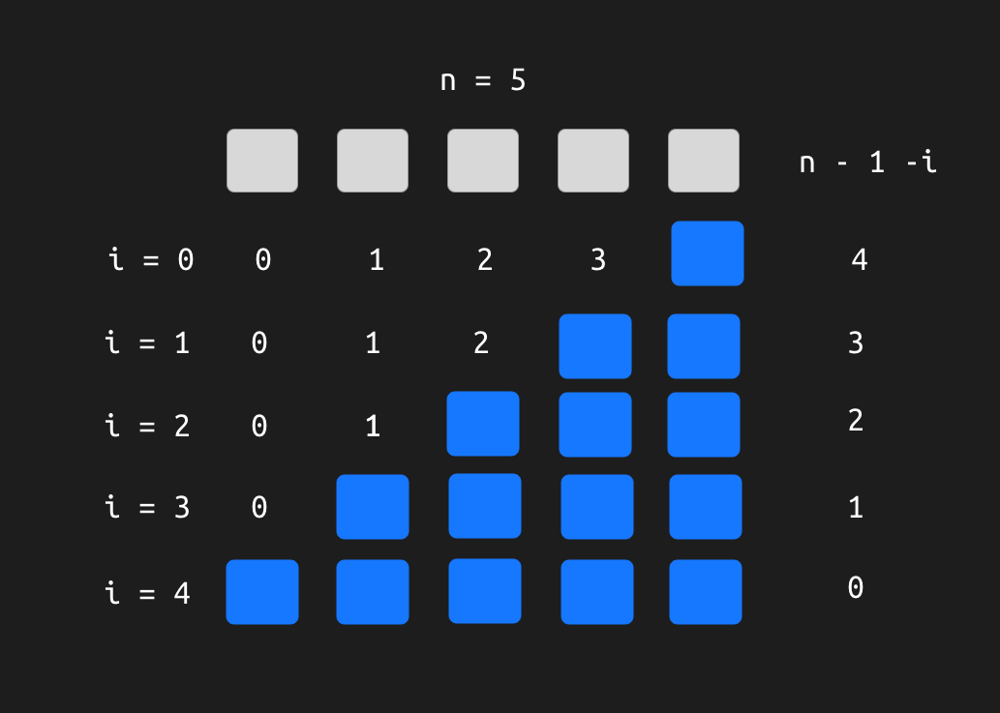
  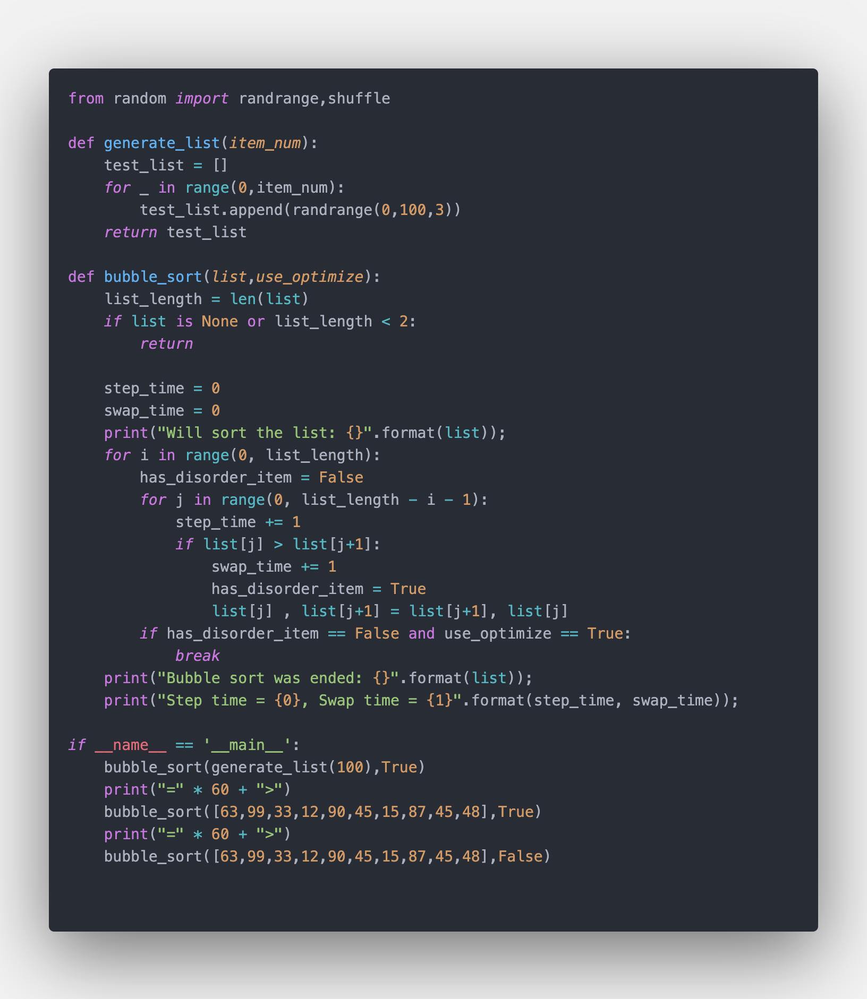

  时间复杂度：O(n2)     
  空间复杂度：O(1)  
  稳定排序  
  原地排序  

* ****选择排序****

  算法原理：
  每次都确定一个位置的值，在这个过程中会遍历剩下未排序的值，从中选择最小的那个，将它调换到待确定的位置。

  
  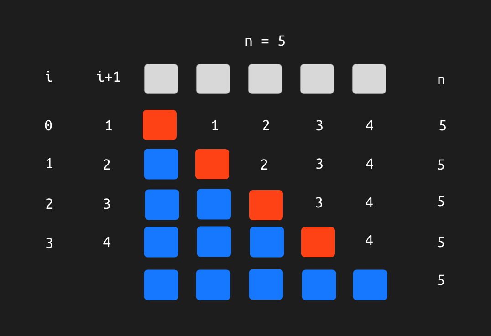
  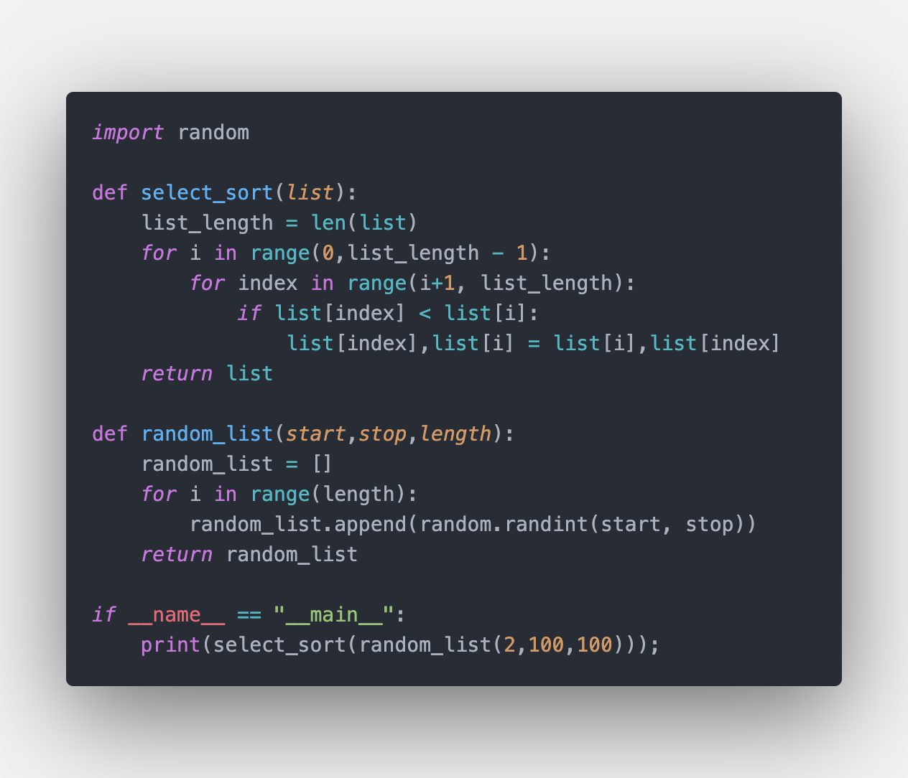
  时间复杂度：O(n2)             
  空间复杂度：O(1)  
  非稳定排序    
  原地排序

* ****插入排序****

  算法原理：

  外循环从index为1开始（第一项不用确定），到最后一项
  分成如下几步：
  1. 找到当前要确定位置的元素i，将该元素拷贝到临时变量(因为后续挪位置到时候会被覆盖掉)
  2. 从当前位置遍历它之前的元素，找到比它小的或者等于它的，元素索引假设为k
  3. 将k+1 到 i-1的元素往后挪位置，腾出k+1位置，插入元素
  
  
  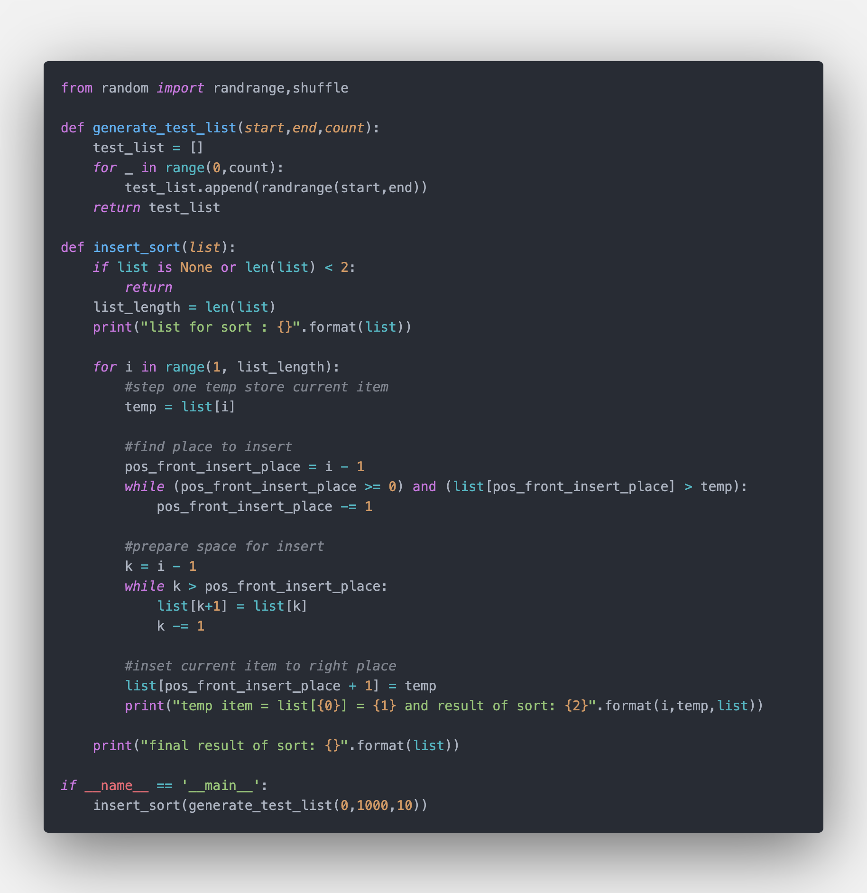
  时间复杂度：O(n2)             
  空间复杂度：O(1)  
  稳定排序    
  原地排序

* ****希尔排序****

  算法原理：

  插入排序对于小数据量只有部分数据无序的数组来说尚可应付，但是一旦数据集增大性能就会大打折扣，希尔排序是插入排序的进一步升级，它的核心思想是将整个待排记录序列分割成间隔相同的若干子序列，分别进行直接插入排序。每次排序结束后都会不断缩小间隔，待整个序列中的记录基本有序时，再对全体记录进行一次直接插入排序。由于这时候序列基本有序了直接插入排序效率就非常高，
  
  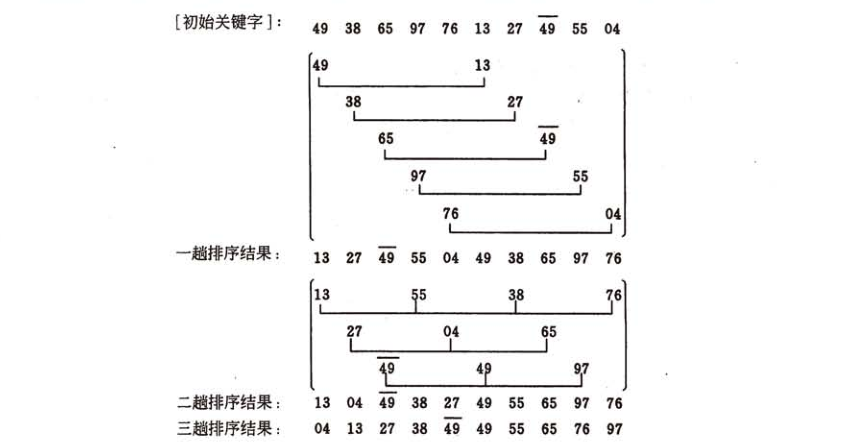
  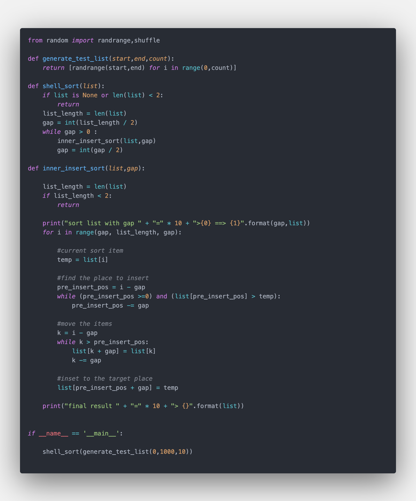


* ****堆排序****

  算法原理：
  堆排序算法建立在堆数据结构的基础之上，所以在了解该算法之前，大家可以看下上面介绍的堆数据结构，简单说它是一个满足每个结点的都是它子树的最值，最小值的时候这个堆，叫做小顶堆，最大值的时候这个堆叫做大顶堆，我们下面只以小顶堆为例子，在添加元素的时候会先将元素添加到最后一个结点，然后由前完后，不断找它的父结点，把大的父结点降下来，自己升上去，不断循环，直到不能继续往上为止。

  这样排序的时候就比较容易了，首先将顶部的给去出来，这个值一定是最小值，然后将当前堆的最后一个元素，放置到顶部，然后下沉这个结点，下沉过程中，先找到左右结点的最小值，如果比它小，就把最小的子结点提上来，自己下沉下去。不断进行上述步骤，直到没有左右子结点为止。
  
  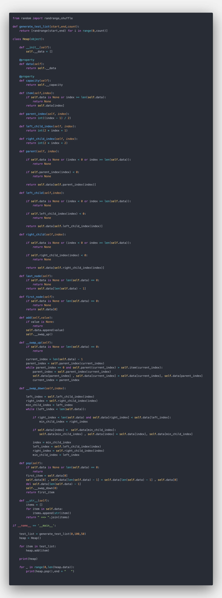
  
* ****归并排序****

  算法原理：
  归并排序使用了递归分治的思想,它首先将整个待排序待序列不断分割，直到不能分割为止，我们认为单一元素是有序的。之后再将这些元素重新组合，简单说就是：先递归划分子问题，然后合并结果，最终形成有序序列。

  
  
  

* ****快速排序****

  算法原理：
  快速排序的核心思想很简单每次都会选择一个标杆数据，下面的例子我们会选择每个区块的第一个元素，然后对其余的元素划分为两类，大于标杆数据，小于标杆的数据，在划分的过程中每个区块里面没有完全排好序，划分好后，再不断对左区块右区块内元素进行快速排序，一直到结束。

  
  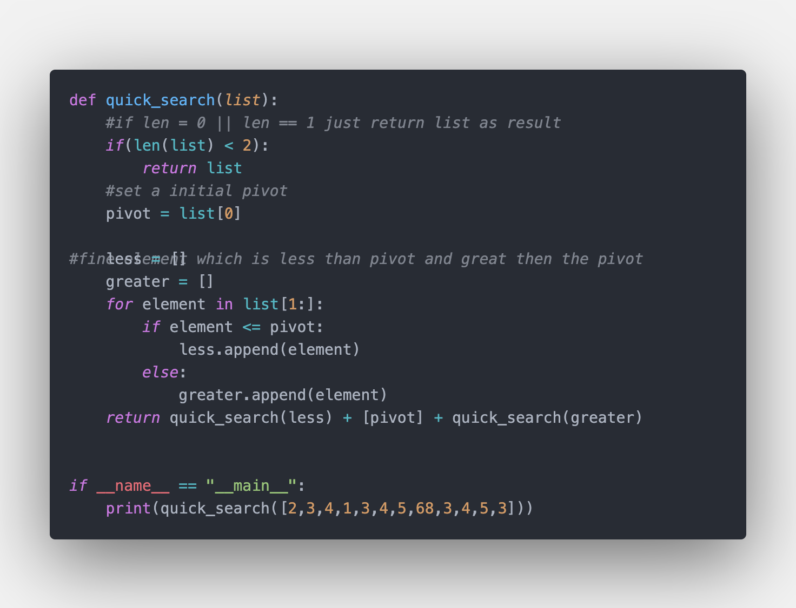

* ****计数排序****
  
  算法原理：
  首先明确计数排序仅仅适合于待排序的元素之间范围较小的整数序列，但是对于数据量来说多少无所谓，它的优点就是比前面的O(nlogn)排序速度更快。它的基本思想是用待排序的数作为计数数组的下标，统计每个数字的个数。然后依次输出，即可得到有序序列。这里有个比较关键的点是计数排序要求稳定排序时候的处理。下面代码已经给出了。这部分核心思想是将计数，通过累加，变成每个元素的位置信息。
  
  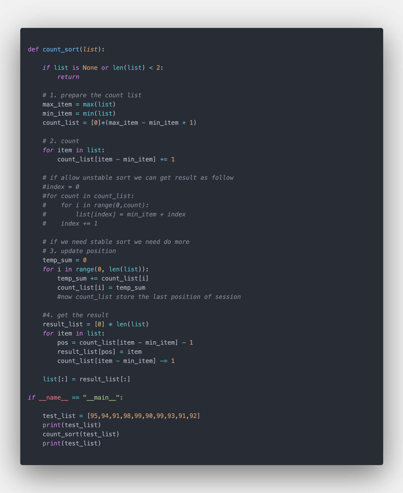
  这里给出一个关于稳定计数排序的视频:[稳定计数排序](https://www.youtube.com/watch?v=OKd534EWcdk)

* ****桶排序****

  算法原理：
  看过计数排序大家都应该了解它的两大限制1.数据范围不能太大，2.必须是整数，其实这两个限制都是为了能够将待排序数据划分成有限个区间而规定的，桶排序为了解决这个问题，将区间划分成固定的几个，但是每个区间内存放的数据可以多个。
  桶排序先按照桶数以及待排序数据的最大值，最小值，确定数据边界，然后，将一个个数据加入对应的桶中。
  紧着这对每个桶中的数据进行排序。最后依次将这些桶的数据输出，即可完成排序。
  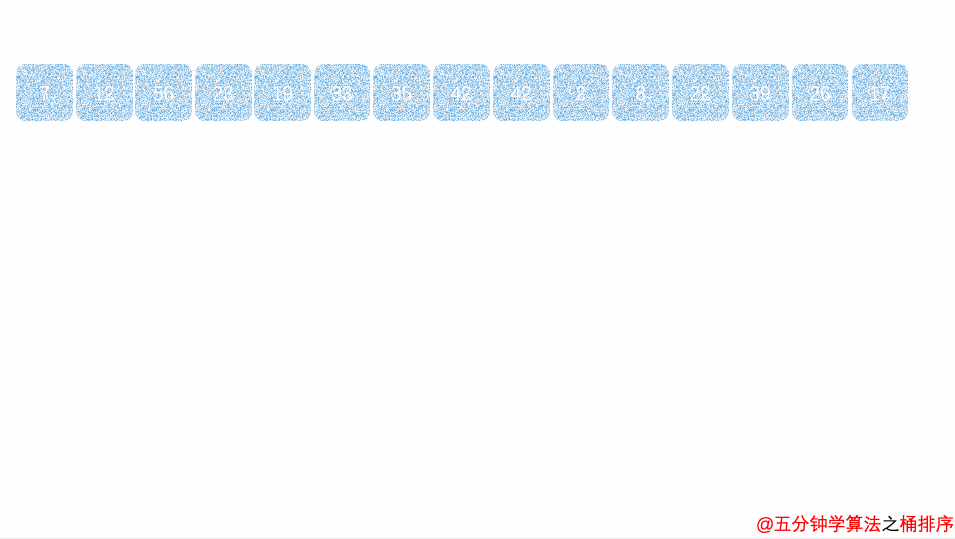
  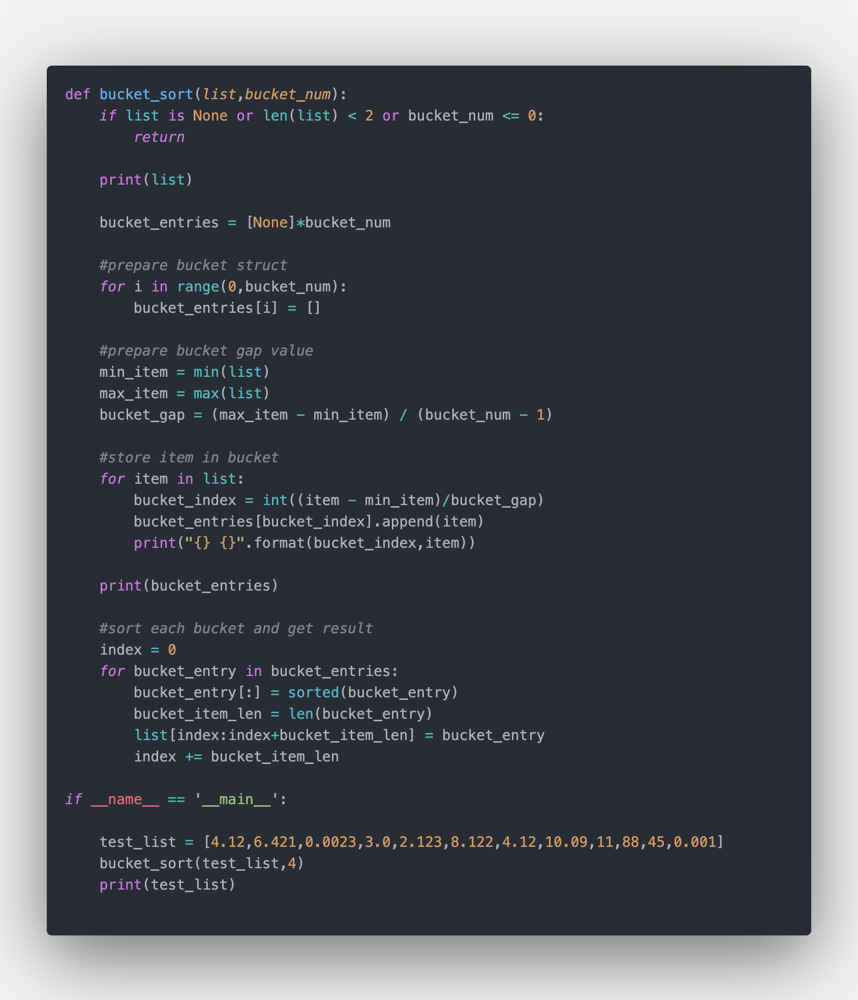
  如果相对于同样的待排序数据规模，桶数量越大，其效率越高，最好的时间复杂度达到O(n)。当然桶排序的空间复杂度为O(n+m)，如果输入数据非常庞大，而桶的数量也非常多，则空间代价无疑是昂贵的。此外，桶排序是稳定的。


* ****基数排序****

  算法原理：
  基数排序是一种借助多关键字排序思想，对单逻辑关键字进行排序的方法。基数排序是通过多次的收分配和收集来实现的，关键字优先级低的先进行分配和收集。里面用到了桶排序的原理。具体可以查看如下代码：
  
  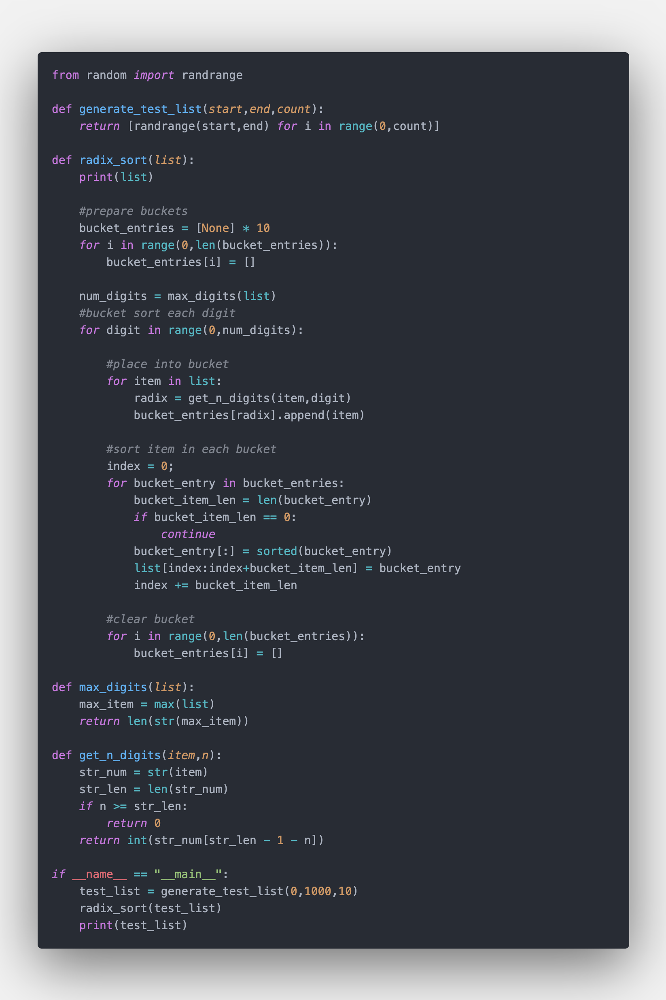

##### 排序算法总结

上面提到的十种排序算法可以分成如下几类：

冒泡排序、选择排序、插入排序这三种简单的排序及其变种快速排序、堆排序、希尔排序三种比较高效的排序。基于分治递归思想的归并排序，还有计数排序、桶排序、基数排序三种线性排序。

* 从平均时间来看，快速排序是效率最高的。但快速排序在最坏情况下的时间性能，不如堆排序和归并排序。而后者相比较的结果是在n较大时，归并排序使用时间较少，但使用辅助空间较多。
* 上面说的简单排序，包括除希尔排序之外的所有冒泡排序、插入排序、简单选择排序。其中直接插入排序最简单。但序列基本有序或者n较小时，直接插入排序是好的方法。因此常将它和其他的排序方法，如快速排序、归并排序等结合在一起使用。
* 基数排序的时间复杂度也可以写成O(d*n)。因此它最适合使用于n值很大而关键字较小的的序列。若关键字也很大，而序列中大多数记录的最高关键字均不同，则亦可先按最高关键字不同，将序列分成若干小的子序列，而后进行直接插入排序。
* 从方法的稳定性来比较，基数排序是稳定的内排方法，所有时间复杂度为O(n^2)的简单排序也是稳定的。但是快速排序、堆排序、希尔排序等时间性能较好的排序方法都是不稳定的。稳定性需要根据具体需求选择。
* 上面的算法实现大多数是使用线性存储结构，像插入排序这种算法，用链表实现更好，省去了移动元素的时间。具体的存储结构，在具体的实现版本中也是不同的。

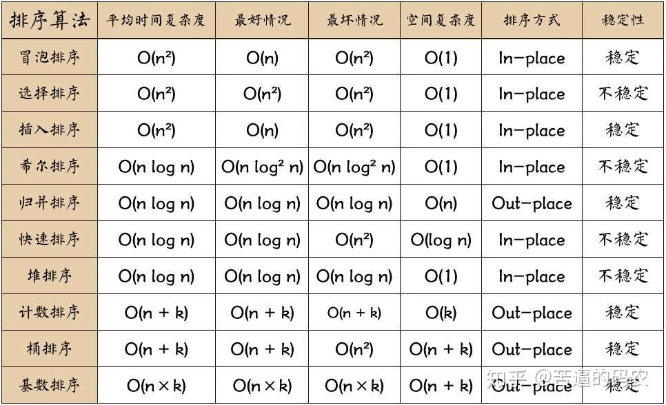

[https://www.jianshu.com/p/c360a58db21d](https://www.jianshu.com/p/c360a58db21d)


#### 2. 查找算法

该部分将会给大家介绍七大查找算法：

1. 顺序查找 O(n) 
2. 二分查找 O(logn)
3. 插值查找 O(log)
4. 斐波那契查找 O(log)
5. 树表查找 O(log)
6. 分块查找
7. 哈希查找 O(1)


* ***相关概念***

* 查找表： 同一类型的数据元素组成的集合
* 静态查找表：只作查找操作的查找表
* 动态查找表：在查找过程中同时插入查找表中不存在的数据元素，或者从查找表中删除已经存在的某个数据元素

* 关键字： 数据元素中某个数据项的值
* 主关键字： 可以唯一标识一个记录的关键字
* 次关键字： 可以识别多个数据的关键字

* 查找就是根据给定的某个值，在查找表中确定一个其关键字等于给定的数据元素。

* ****有序表查找****

* [二分查找]：

前提是线性表中的记录必须是关键字有序。并且线性表必须采用顺序查找。对于静态查找表，一次排序后不再变化，这种情况下，比较适合二分法，但是如果目标数据集需要频繁执行插入或者删除操作，就不适合了，每次查找之前都需要进行排序。
二分法的基本思想是在有序表中取中间记录作为比较对象
```
mid = int((hight + low) / 2);
```
如果给定值和中间记录的关键字相等，则查找成功，若给定值小于中间记录的关键字，则在中间记录的左半区继续查找，如果给定的值大于中间记录的关键字，则在中间记录的右半区继续查找。不断重复，直到查找成功。或所有查找区域无记录，查找失败为止。算法复杂度 O(logn)。

* [插值查找] 将二分法的mid替换为:

```
ratio = (key - list[low])/(list[hight] - list[low])
mid = int(low + ratio * (hight - low))
```
插值查找比较适合于表比较大，并且分布比较均匀的查找表，对于不均匀的表来说不是很合适。算法复杂度也是 O(logn)。

* [斐波那契查找]:

除了二分查找，插值查找算法之外，斐波那契查找提供了使用黄金分割原理来实现查找的思路：

对于斐波那契数列我们知道: 
```
F[index] - 1 = F[index-1] + F[index-2] -1     (index >= 2)
```

具体步骤如下 算法复杂度 O(logn)：

1. 查找斐波那契序列找到序列中出大于或者等于待查数组长度length的最小值所在的index 
2. 使用数组的最后一个元素填充待查数组，使得长度等于上一步确定的斐波那契数值
3. 令 mid = low + F[index - 1] -1
   若 target == list[mid] ，查找成功
   若 target < list[mid]，新的范围是第 low 到第 mid-1，此时该范围个数为 F[index-1]-1 个
   若 target > list[mid]，新的范围就是第 mid+1 到第 high 个，此时该范围个数为 F[index-2]-1个

* ****线性索引查找****

索引是把一个关键字与它对应的记录相关联的过程，一个索引由若干索引项构成，每个索引至少应包含关键字和其对应的记录在存储器中的位置等信息。

* 稠密索引: 稠密索引是指在线性索引中，将数据集中的每个记录对应一个索引项，对于稠密索引表而言，索引项一定要按照关键码有序排列。我们要查找某项数据的适合，可以通过二分法，插值法，斐波那契查找算法来定位对应的关键字索引项，然后再利用对应的指针来获取对应的数据。

* 分块索引：稠密索引因为索引项与数据集的记录个数相同，所以空间代价较大，为了减少索引项的个数，我们可以对数据进行分块，使其分块有序，然后再对每一块建立一项索引，从而减少索引的个数。
  分块索引的每个块都需要满足如下条件：块内数据可以无序但是块间必须有序。这样每个分块索引的索引项可以由如下数据项构成： 最大关键码，块中记录的个数，块首数据元素的地址。
  分块索引步骤：
  在分块索引表中查找要查找关键字所在的块，由于分块索引表是块间有序的所以很容易利用二分法，插值法定位所处的块。
  根据块首指针找到对应的块，并在块中顺序查找关键值。

* 倒排索引: 是通过属性的值来查找记录的位置。

* ****二叉查找树****

上面的两种算法的关注点都是在查找上面，并且要求数据集是有序的线性表，但是实际中我们面临的场景却是有插入删除操作的动态表，所以如何在保证插入删除的高效的同时还能继续保证查找的效率是接下来需要考虑的。
二叉查找树有如下性质：
* 二叉排序树的前提是它们是二叉树。 
* 若它的左子树不空，则左子树上所有结点的值均小于它的根结点的值
* 若它的右子树不空，则右子树上所有结点的值均大于它的根结点的值

二叉查找树的元素插入，删除（删除比较麻烦，分成三种情况，删除的是叶子结点，删除的是仅有左子树，或者右子树的结点，删除左右子树都有结点的结点，对于第三中需要查要删除结点的前驱或者后继结点来替换待删除的结点），搜索.

* ****平衡二叉树****

见树部分

* ****红黑树****

见树部分

* ****多路查找树****

二叉树的要求每个结点最多只能有两个子结点，如果遇到庞大的待处理数据，就会导致树的高度很高，查找某个结点需要遍历的次数就需要很多，从而导致算法效率的降低。
为了解决这个问题，引入了多路查找树，多路查找树的特点是每个结点的孩子数可以多于两个，并且每个结点处可以存储多个元素。它对降低磁盘IO方面有很好的作用。

B树就是常说的"B-树”，又名平衡多路查找树,不论是B树还是下面介绍的B+树都是从下到上构建出来的

****B树****与平衡二叉树的区别：

见树部分

****B+树**** 它比 B 树的查询性能更高。

见树部分

* ****哈希查找****

哈希技术是在记录的存储位置和它的数据之间建立一个确定的对应关系f（散列函数），使得每个关键字key对应一个存储位置，采用散列技术将记录存储在一块连续存储空间中，这块连续的存储空间称为散列表。
散列技术既是一种存储方法，又是一种查找方法。

****散列函数的要求：****

- 计算简单
- 散列地址分布均匀

如下是几种常见的****散列函数：****

* 直接定址法:

```
f(key) = key
```

* 除留余数法

```
f(key) = key mod p
```
一般p为小于或者等于表长的最小质数，或者不包含小于20质因子的合数

* 数字分析法:
比较适合于关键字位数比较大的情况，这种情况一般会抽取关键字的一部分来计算散列的存储位置。

* 平方取中法:
对关键字取平方后，选中当中的若干位，它适合于不知道关键字的分布，而位数又不是很大的情况。

* 折叠法:
将关键字从左到右分割成位数相等的几部分，然后将这几部分叠加求和，并按散列表表长，取后几位作为散列地址。

* 随机数法:

```
f(key) = random(key)
```

****处理散列冲突的方法：****

* 试探地址法：
一旦发生冲突，就去寻找下一个空的散列地址，只要散列表足够大，空的散列地址总能找到：
```
f(key) = (f(key) + d) mod m (di = 1,2,3,4,5,6...m-1) 线性试探
```
试探地址法会出现的问题是：堆积，原本不会冲突的但是原先的位置被占领而导致冲突。
为了不让关键字都聚集在某一块区域，可以将d改为1平方，2平方...这种称为二次试探，d还可以使用伪随机数，对应的称为随机试探。

* 链地址法：
这个就不用多介绍了把，很常见。

* 公共溢出区法：
为所有的冲突的关键字建立一个公共的溢出区域用来存放。

****散列表查找性能影响因素****

- 散列函数是否均匀
- 处理冲突的方法
- 散列表的装载因子 
  装载因子 = 填入表中记录个数/散列表长度。装载因子越大产生冲突的可能性越大，当到达一定程度可以通过加倍散列表空间来降低碰撞的产生。

#### 3. 算法策略

这部分将要给大家介绍算法策略，算法策略是对一类算法的思想进行归纳，是指导我们解决问题的思路，这里将介绍：
递归，回溯，分治，贪婪，动态规划这五大算法策略。

#### 3.1 递归 Recursive

最早接触递归是在学习C语言的时候，只是记住了递归就是方法自己调用自己，以及学会了写斐波那契解法，在后面看到C和指针一书的时候才对递归有了进一步的认识。

如果大家对递归不熟悉，建议先看下C和指针一书的相关章节，这里只是对递归做一个简单总结，后续可能会对这一部分进行扩展。假设大家都用过递归，我们来做个总结：

首先递归有如下要点：

* 递归就是方法自己调用自己
* 那么递归什么时候停止？这就涉及到了基线条件和递归条件：
  递归条件指的是满足什么条件方法自己会调用自己。
  基线条件指的是满足什么条件会停止递归，从而避免无限循环
* 递归的实现主要依赖的是调用栈这个特殊的数据结构。
  在每次使用递归的时候，计算机会先为该函数分配一个内存空间，递归和普通函数不一致的情况在于它除非遇到基线条件，否则不会将当前函数的内存空间从调用栈移除，只是会将当前函数暂停并处于未完成状态，然后为新的递归分配新的内存空间，并将这个新的内存空间入栈。一旦达到了基线条件，有了问题的解后，就会将递归栈中的函数内存空间，不断执行出栈操作，每次出栈都会把上次未完成的函数任务完成后返回。
* 递归的最大问题主要有两点：1. 忽视了基线条件很容易导致无限循环，2.如果递归的层次较深，则对堆栈的内存空间资源耗费较大。这个问题可以通过将递归使用循环实现，或者采用尾递归的方案来实现。

****尾递归****

尾递归主要是为了解决递归算法递归层级较深的情况下会耗费较多的内存空间问题而提出来的，它比普通递归多一个参数，这个参数是上一次调用函数得到的结果，从而导致尾递归只占用恒量的内存。避免了普通递归不收集结果只能依次展开而带来的内存消耗的问题。

下面使用Stack Overflow 的问题来帮助大家理解，问题见[What is tail recursion?](https://stackoverflow.com/questions/33923/what-is-tail-recursion)

下面是普通递归的实现：

```
def recsum(x):
  if x == 1:
    return x
  else:
    return x + recsum(x - 1)
```
这是调用堆栈，由于计算到中间步骤的时候不能获得最终的结果，所以也要把中间值放在递归堆栈中，这就是造成递归内存问题的主要原因。
```
recsum(5)
5 + recsum(4)
5 + (4 + recsum(3))
5 + (4 + (3 + recsum(2)))
5 + (4 + (3 + (2 + recsum(1))))
5 + (4 + (3 + (2 + 1)))
5 + (4 + (3 + 3))
5 + (4 + 6)
5 + 10
15
```

下面是尾递归的实现方案，这里多出一个参数，每次进行计算的时候会用将上一次的计算结果刷新这个值。

```
def tailrecsum(x, running_total=0):
  if x == 0:
    return running_total
  else:
    return tailrecsum(x - 1, running_total + x)
```


#### 3.2 分治算法 Divide And Conquer

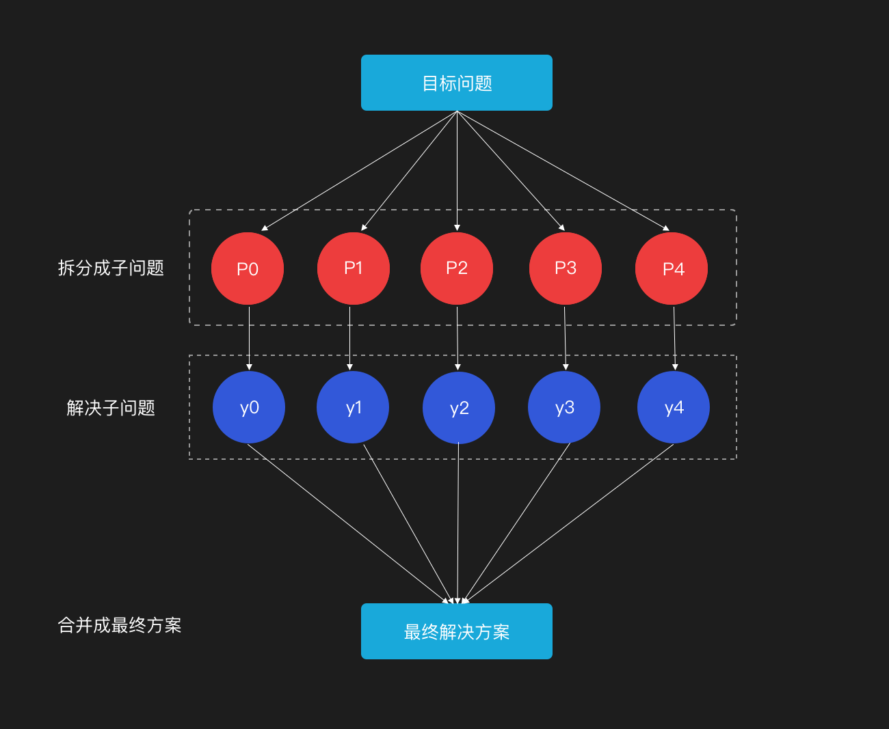

****分治算法思想：****

分治算法就是将一个复杂的大问题，不断划分为****相同或相似****的子问题，再把子问题分成更小的子问题，直到最后子问题可以用简单的方案直接求解为止。然后对各个子问题一一进行处理，最后将这些子问题的解决方案进行合并获得最终的解决方案。

****哪些特征的问题可以使用分治算法：****

* 主问题太过庞大，直接使用某种算法不好处理，但是该问题的规模缩小到一定程度后就可以以十分容易的方案解决掉。
* 这些子问题必须是同类的子问题，能够以一种相同的算法来处理。只不过处理问题的规模变小而已，而不是将主问题进行划分步骤后将其分配到各个子问题，虽然问题规模也会变小，但是这不是分治算法。
* 这些子问题的结果必须是能够合并的。
* 这些子问题必须是相互独立的。

****步骤：****

****Step1 分解****：将原问题分解为若干个****规模较小***，****相互独立****，与原问题****形式相同****的子问题

****Step2 解决****：若子问题规模较小而容易被解决则直接解，否则递归地拆解各个子问题

****Step3 合并****：将各个子问题的解合并为原问题的解。


其中|P|表示问题P的规模
n0为阈值，表示当问题P的规模不超过n0时，问题已容易直接解出，不必再继续分解。
ADHOC(P)是该分治法中的基本子算法，用于直接解小规模的问题P。
算法MERGE(y0,y1,...,yk-1)是该分治法中的合并子算法，用于将P的子问题P0 ,P1 ,...,Pk-1的相应的解y0,y1,...,yk-1合并为P的解。

****分治法的复杂性分析：****

假设问题规模为n的主问题可以采用分治算法分成k个规模为n/m的子问题去解：
并作出如下假设：

* 问题分解阈值n0 = 1
* ADHOC解规模为n0的问题耗费时间为1个单位
* 将原问题分解为k个子问题以及用merge将k个子问题的解合并为原问题的解需用f(n)个单位时间
  
那么分治算法的复杂度为：
```
T(n) = kT(n/m) + f(n)
```
****哪些地方用到了分治算法：****

* 二分查找法
* 归并排序
* 快速排序算法
* 汉诺塔

#### 3.3 贪心算法 Greedy

****贪心算法思想：****
  
贪心算法的核心思想就是每次作出决定的时候都是着眼于眼前最好的选择，而不是从宏观整体上加以考虑，因此导致它所作出的决定仅仅在某种意义上的局部最优解。算法关键是贪心策略的选择。为什么要选择贪心算法呢？我们知道受限于计算机的内存，CPU，并不是所有的问题都能在有限的时间找到全局最优解，或者说找到全局最优解的所付出的代价并不值得，局部最优解已经能够满足我们对问题答案的要求，这种情况下我们往往会通过贪心算法，来获得一个局部最优解，作为替代。

贪心算法的应用会在后续的时间推出，这个阶段先掌握下这个算法思想。

#### 3.4 动态规划 Dynamic programming

****动态规划算法思想：****

动态规划算法核心思想是将一个棘手的大问题，划分成多个小问题，通过解决这些小问题最终解决要解决的问题。在动态规划算法中每次决策依赖于当前状态，又随即引起状态的转移。这种情况就会导致无法确定地事先设定好决策序列，而是需要在动态变化的状态中一步步地确定后续的决策序列。它的基本思想与分治法类似：将待求解的问题分解为若干个子问题，按顺序求解子阶段，前一子问题的解，为后一子问题的求解提供了有用的信息。在求解任一子问题时，列出各种可能的局部解，通过决策保留那些有可能达到最优的局部解，丢弃其他局部解。依次解决各子问题，最后一个子问题就是初始问题的解。它与分治法最大的差别是：适合于用动态规划法求解的问题，经分解后得到的子问题往往不是互相独立的，即下一个子阶段的求解是建立在上一个子阶段的解的基础上，进行进一步的求解。

#### 3.5 回溯 BackTracking

来来来，开始讲回溯之前来点轻松的先看下视频，很有趣的，但是记得回来哈：

* [Backtracking and Level Design - Making a Way Out - Extra Credits](https://www.youtube.com/watch?v=-H97gCCJFXA)
* [Backtracking (Think Like a Programmer)](https://www.youtube.com/watch?v=gBC_Fd8EE8A)

 回溯算法有点类似于遍历搜索的过程，每次都会从可选路径中选择一条最优的方向，沿着一个方向来试图寻找问题的解决方案，在这个过程中一旦发现走进了"死胡同"（发现原先选择不优，或者正在偏离解决问题的目标的时候），继续沿着这个方向探索没有任何解决方案，就进行回溯，尝试另一个方向，直到最终找到问题的解决方案为止。这种走不通就退回再走的技术为回溯法，而满足回溯条件的某个状态的点称为"回溯点"。这种方法适用于解一些组合数相当大的问题。

在开始进行回溯之前必须有包含问题的所有解的解空间树，以供每次调整方向的时候选择，从根结点出发深度探索解空间树。当探索到某一结点时，要先判断该结点是否包含问题的解，如果包含，就从该结点出发继续探索下去，如果该结点不包含问题的解，则逐层回溯。回溯问题也分为两类：一类是用回溯法求问题的所有解时，要回溯到根，且根结点的所有可行的子树都要已被搜索遍才结束。而另一类使用回溯法求任一个解时，只要搜索到问题的一个解就可以结束。

简单概括就如下几个步骤：

* 确定问题的解空间，解空间应至少包含问题的一个最优解
* 确定路径结点的扩展搜索规则
* 以深度优先方式从根结点出发搜索解空间树，算法搜索至解空间树的任意一点时，先判断该结点是否包含问题的解。如果肯定不包含，则跳过对该结点为根的子树的搜索，逐层向其祖先结点回溯；否则，进入该子树，继续按深度优先策略搜索。在遍历过程中需要有记录以及访问的结点。
* 并在搜索过程中用剪枝函数避免无效搜索。所谓的剪枝函数就是约束条件或目标函数的界，即判定该节点是否包含问题的解。如果肯定不包含，则跳过对以该节点为根的子树的搜索。  
  
* [Introduction to Backtracking - Brute Force Approach](https://www.youtube.com/watch?v=DKCbsiDBN6c)

#### 3.6 分支定界法 Branch and bound

****分支定界算法介绍****

分支定界类似于回溯法，也是在问题的解空间树T上搜索问题解的算法，它一般用于解决最小值优化算法，或者能够转化为最小值的最大值问题，它和回溯法不同的是：在遍历问题解空间树的时候，它采用广度优先的策略，依次搜索E-结点的所有分支，也就是所有相邻结点，抛弃不满足约束条件的结点，其余结点加入活结点表。然后从表中选择一个结点作为下一个E-结点，继续搜索。它使用的是堆栈作为辅助遍历数据结构，而回溯法是基于深度优先遍历算法，使用队列作为辅助遍历数据结构。

分支限界法的搜索策略是：在扩展结点处，先生成其所有子结点，然后再从当前的活结点表中选择下一个扩展对点。为了有效地选择下一扩展结点，以加速搜索的进程，在每一活结点处，计算一个限界值，并根据这些已计算出的函数值，从当前活结点表中选择一个最有利的结点作为扩展结点，使搜索朝着解空间树上有最优解的分支推进，以便尽快地找出一个最优解。分支限界法与回溯法对当前扩展结点所使用的扩展方式不同。在分支限界法中，每一个活结点只有一次机会成为扩展结点。活结点一旦成为扩展结点，就一次性产生其所有儿子结点。在这些儿子结点中，那些导致不可行解或导致非最优解的儿子结点被舍弃，其余儿子结点被子加入活结点表中。此后，从活结点表中取下一结点成为当前扩展结点，并重复上述结点扩展过程。这个过程一直持续到找到所求的解或活结点表为空时为止。

#### 4. K最临近算法 KNN

K最临近算法主要用于分类和回归：
```
分类就是对数据进行编组
回归就是对结果进行预测
```
决定KNN算法成败的最关键的因素在于特征的选取，也就是说如何将研究对象，转化为一系列可比较可量化的数字。

KNN步骤：

* 定义物体，抽取物体特征
* 将待研究对象的特征与已经归类好的物体的特征相似程度进行比较。这一步可以使用某种距离进行量化，那么它和距离最近的物体归为一类。
* 一旦建成上述的分类系统，就可以根据上述的系统的每个类别整体特性，来预测上述系统某个类别中的单个个体的行为，也就是上面提到的回归。

KNN 最关键的部分在于两点：特征的抽取以及相似度的计算。

### 三. 学习材料推荐

* [https://www.youtube.com/channel/UCD8yeTczadqdARzQUp29PJw](https://www.youtube.com/channel/UCD8yeTczadqdARzQUp29PJw)
* [https://www.youtube.com/playlist?list=PLDN4rrl48XKpZkf03iYFl-O29szjTrs_O](https://www.youtube.com/playlist?list=PLDN4rrl48XKpZkf03iYFl-O29szjTrs_O)
* [https://www.youtube.com/user/mikeysambol](https://www.youtube.com/user/mikeysambol)
* [[Data Structure & Algorithm] 七大查找算法](https://www.cnblogs.com/maybe2030/p/4715035.html)
* [[Data Structure & Algorithm] 八大排序算法](https://www.cnblogs.com/maybe2030/p/4715042.html)

* [GitHub标星15K，这个开源项目让算法动起来](https://www.tinymind.cn/articles/4179)
http://zh.lucida.me/blog/on-learning-algorithms/
* [Sound of sorting](http://panthema.net/2013/sound-of-sorting/)
* [Sound of sorting Youtu](https://www.youtube.com/watch?v=kPRA0W1kECg&t=15s)
* [Sorting Algorithms](https://www.toptal.com/developers/sorting-algorithms)
* [https://www.youtube.com/watch?v=lahPKUJEhHU](https://www.youtube.com/watch?v=lahPKUJEhHU)
* [https://www.youtube.com/watch?v=pVfzNyNRqxk&list=PLljKjXpjNpge8KFkTgqWoR4qwKOW5iU_F](https://www.youtube.com/watch?v=pVfzNyNRqxk&list=PLljKjXpjNpge8KFkTgqWoR4qwKOW5iU_F)
* [https://www.pdai.tech/](https://www.youtube.com/watch?v=YgzpqlF54lo&list=PLKQ5LYb497AZIZe9dBWy8GwLluVaMQVj0)
* [https://www.jianshu.com/p/a0941781926d](https://www.jianshu.com/p/a0941781926d)
* [https://algorithm-visualizer.org/simple-recursive/cellular-automata](https://algorithm-visualizer.org/simple-recursive/cellular-automata)
* [http://www.cppblog.com/menjitianya/archive/2015/10/23/212084.html](http://www.cppblog.com/menjitianya/archive/2015/10/23/212084.html)


